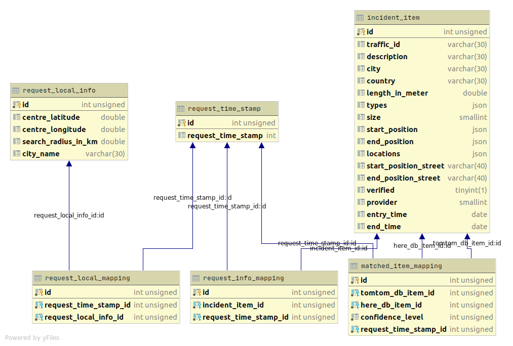
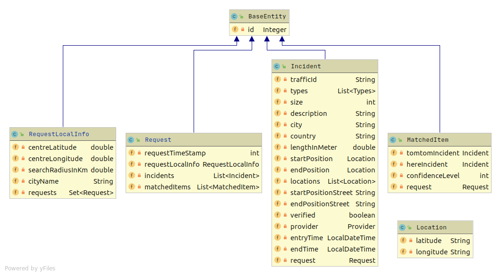

# Spring Boot Data proof of concept on a normalized database

This project is a implementation of Spring Boot Data on a complex entity model.
These models are derived from a normalized database.

## Implemented Concepts

- CRUD repositories
- @ManyToOne
- @OneToMany
- @JoinTable
- @Convert
- Projection

## Background

The database is from another project. The main task is to save traffic incidents from two Providers.
Namely Here.com and TomTom and evaluate them against each other.

The Incidents will be frequently saved in a Request data structure. It holds the time stamp of the request and the 
location of the incidents. Also in the Request will be a data structure for matched items. It holds a matched TomTom and
Here incident with its calculated confidence level.

## Database tables

### incident_item
It holds every data that is necessary to describe an incident. `Start_position`, `End_position` are Location objects that
will be saved as a json. See the converter classes. `Locations` holds a list of `Location`. `Types` is a list of Strings also
saved as a json.

### request_time_stamp, requet_local_info, request_local_mapping
Toge``ther they build a Request. A Request consists of a timestamp and local information (Where the incidents will saved 
like coordinates and city name).

To put Incidents and there associated Request together we use `request_info_mapping`.

### matched_item_mapping
The Matched Items consist of a Here.com and TomTom Incident. The confidence score is also saved with them.
Of course the matched item is associated with same Request as the Incidents.

## Entities

The way the entites are managed are heavely inspired by Spring Boots [Pet Clinic](https://github.com/spring-projects/spring-petclinic). 
To avoid java boilerplate [Lombok](https://projectlombok.org/) is used.

### Incident
Is mapped to `incident_item`. 

Request is retrieved trough `@JoinTable` with `request_info_mapping`. 

`Start_position`, `end_position`, `locations` and `types` are converted through `@Convert` with their respective converter.

### MatchedItem
Is mapped to `matched_item_mapping`.

`tomtomIncident`, `hereIncident` and `request` are retrieved through `@JoinColumn` with their respective database item ids.

### Request
Is mapped to `request_time_stamp`.

The local info is mapped trough `@JoinTable` with `request_local_mapping`.

Incidents and Request are bidirectional mapped trough `@OneToMany(mappedBy = "request")`. In their counterpart: Incident 
and MatchedItem are already `@ManyToOne` associations that allows the mapping.